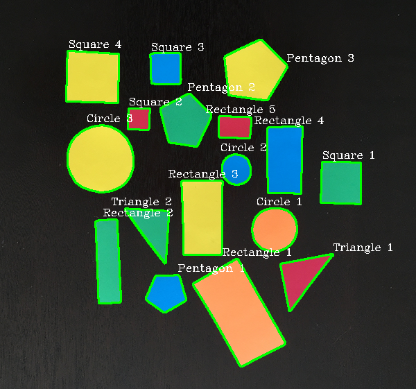
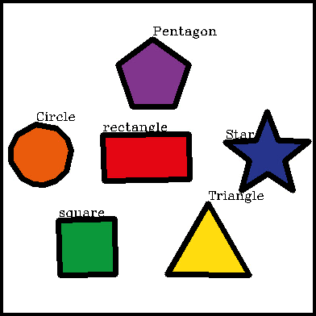

# basic-shape-detection
This project is use to detect basic shape such as triangle, square, pentagon, rectangle and circle without using any Machine Learning or 
Deep Learning approach. This project mainly to learn OpenCV package.

# Methodology
1) Apply GaussianBlurr to reduce noise for the next process
2) The blurred image will use Canny Edge Detection method to detect the edge in the picture
3) Find countour and draw it in original image (This will highlight the outer edge only)
4) Determine the vertices on a contour shape to another shape depending upon the precision we specify (this will use to determine shape)
5) Start initial count for each detected shape (triangle, square, rectangle, circle and pentagon)

Final output for shape-detection.ipynb will be like this:

Final output for test-shape.ipynb will be like this:\

